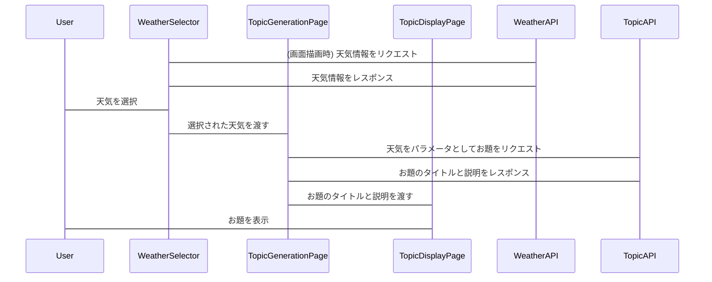

# 散歩のお題作成システム フロントエンド・バックエンドAPI連携 実装計画

## 1. 現状把握

*   **フロントエンド:** Next.js (React) で構築。`sanpo-topic-generator/src/app/topic_generation/page.tsx` が主要なコンポーネント。
*   **バックエンド:**
    *   お題API: `sanpo-topic-generator/src/app/api/topic/fetch/route.ts`
    *   天気API: `sanpo-topic-generator/src/app/api/fetch-weather-data/route.ts`
*   **UI:**
    *   天気選択UI: `sanpo-topic-generator/src/app/topic_generation/WeatherSelector.tsx`
    *   お題表示: `sanpo-topic-generator/src/app/topic_generation/topic_display/page.tsx`

## 2. 実装計画

1.  **天気APIとの連携 (WeatherSelector.tsx):**
    *   `WeatherSelector.tsx` で、`useEffect`フックを使用して、コンポーネントのマウント時に天気API (`sanpo-topic-generator/src/app/api/fetch-weather-data/route.ts`) から天気情報を取得する。
    *   APIリクエストの送信とレスポンスの処理を実装する。
    *   取得した天気情報をステートとして保持し、選択肢として表示する。
    *   MUIのコンポーネントを使用して、UIを構築する。
2.  **お題APIとの連携 (topic_generation/page.tsx):**
    *   `topic_generation/page.tsx` で、天気選択UI (`WeatherSelector.tsx`) で選択された天気をパラメータとして、お題API (`sanpo-topic-generator/src/app/api/topic/fetch/route.ts`) にリクエストを送信する。
    *   APIリクエストの送信とレスポンスの処理を実装する。
    *   APIレスポンスとして返却されたお題のタイトルと説明を、ステートとして保持する。
3.  **お題の表示 (topic_display/page.tsx):**
    *   `topic_display/page.tsx` で、`topic_generation/page.tsx` から渡されたお題のタイトルと説明を表示する。
    *   MUIのコンポーネントを使用して、UIを構築する。
4.  **エラーハンドリング:**
    *   APIリクエストが失敗した場合のエラーハンドリングを実装する。
    *   エラーメッセージを画面に表示する。
5.  **ローディング表示:**
    *   APIリクエスト中にローディング表示を追加する。
6.  **UIの改善:**
    *   MUIのコンポーネントを使用して、UIを改善する。
    *   レスポンシブデザインに対応する。

## 3. 技術的な詳細

*   **APIリクエスト:** `fetch` APIまたは`axios`などのHTTPクライアントを使用する。
*   **ステート管理:** Reactの`useState`フックを使用する。
*   **UIフレームワーク:** MUI (Material UI) を使用する。
*   **型定義:** TypeScriptを使用して、APIリクエストとレスポンスの型を定義する。
*   **環境変数:** APIエンドポイントを環境変数として設定する。

## 4. Mermaidダイアグラム

## 5. 補足

*   必要に応じて、コンポーネントを分割し、再利用性を高めます。
*   テストコードを追加することを推奨します。