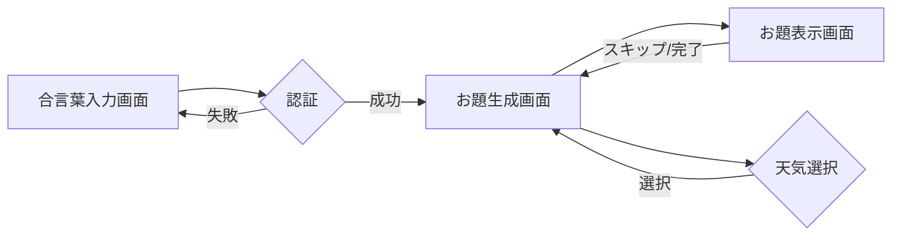

# UI設計 (v1)

## 実装のスコープ
#### 基本的な画面遷移やUIの開発
デザイン全体としてポップよりなデザインとし、UIはリッチなものにすること

## ディレクトリ構成

```
app/
├── authentication/  # 認証画面
└── topic_generation/
    └── topic_display/  # お題生成画面、お題表示画面
```

## 画面遷移図



## 各画面のUI要素

### 合言葉入力画面
*   テキストフィールド (合言葉入力)
*   ボタン (認証)

### お題生成画面
*   天気選択
*   ボタン (お題生成)

### お題表示画面
*   お題
*   ボタン (スキップ)
*   ボタン (完了)

## コンポーネント構成

*   App
    *   合言葉入力画面
    *   お題生成画面
    *   お題表示画面

## デザインに関する考慮事項

*   スマートフォンで利用することを前提としたレスポンシブデザイン
*   お題完了時にConfettiを表示

## 今後の実装方針
*   サーバーサイドの処理を含めた実装の際に詳細な分岐を含めた実装を行う